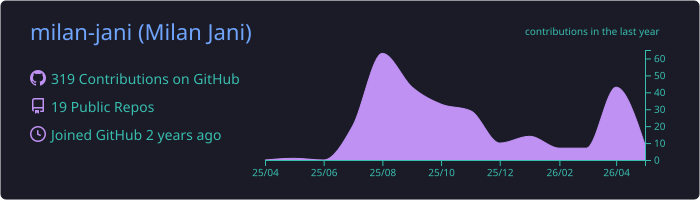
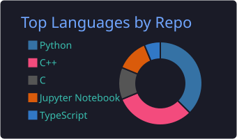
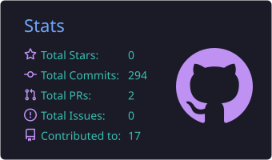
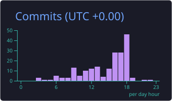
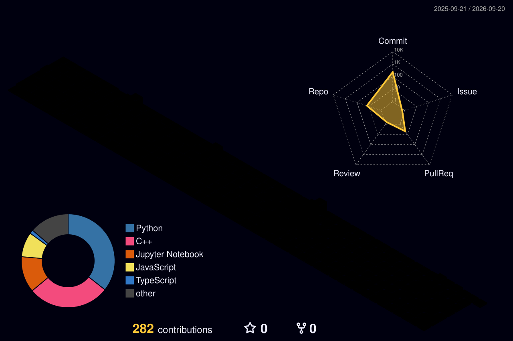

<div align="center">

<!-- ═══════════════════════════════════════════════════════════ -->
<!-- Capsule Render — Animated Waving Header -->
<!-- ═══════════════════════════════════════════════════════════ -->


<!-- Typing SVG Animation -->
<a href="https://git.io/typing-svg">
  
</a>

<br>

<!-- Profile Views Counter -->


</div>

<!-- ─── Section Divider: Indigo ─── -->


## About Me

```yaml
Name: Milan Jani
Education: B.Tech ICT @ Marwadi University (GPA: 9.03/10)
Role: VLSI, Digital Design & Embedded Systems Enthusiast
Location: India

Focus Areas:
  - VLSI: ASIC Flow, Circuit Layout & Backend Verification
  - Embedded: ARM, MSP430 & ESP32 System Design
  - Robotics: Motion planning & control in Isaac Sim & Lab
  - Research: MIMO Antenna Analysis

Interests:
  - Hardware-Software Co-Design
  - Serial Communication Protocols
  - Local AI Deployment (Gemma/Ollama) on Edge Devices
```

<!-- ─── Section Divider: Purple ─── -->


## Tech Arsenal

<div align="center">

<h3>Languages</h3>
<p>
  
  
</p>

<h3>Tech & Platforms</h3>
<p>
  
  
</p>

<br>

| Category | Technologies |
|:---|:---|
| **Core & VLSI** | ASIC Flow · Circuit Layout · Verilog (HDL) · Reinforcement Learning (RL) · Isaac Sim & Lab |
| **Languages** | C · C++ · Embedded C · Python · Shell Scripting |
| **MCUs / SBCs** | ARM · MSP430 · ESP32 · Raspberry Pi |
| **Tools & Platforms** | Keil · CCS · KiCad · LTspice · Microwind · Proteus · Docker · Linux |
| **Protocols** | UART · SPI · I2C · CAN |

</div>

<!-- ─── Section Divider: Violet ─── -->


## GitHub Analytics

<div align="center">

<!-- Profile Details (Static SVG — always loads) -->
<a href="https://github.com/milan-jani">
  
</a>

<br>

<a href="https://github.com/milan-jani">
  
</a>
&nbsp;&nbsp;
<a href="https://github.com/milan-jani">
  
</a>

<br>

<a href="https://github.com/milan-jani">
  
</a>
&nbsp;&nbsp;
<a href="https://github.com/milan-jani">
  
</a>

<br><br>

<!-- 3D Contribution Graph (Generated via GitHub Action — will load after first Action run) -->


<br><br>

<!-- Streak Stats -->
<a href="https://git.io/streak-stats">
  
</a>

<br><br>

<!-- Activity Graph -->


<br><br>

<!-- GitHub Trophies -->


</div>

<!-- ─── Section Divider: Light Violet ─── -->


## Achievements & Projects

<div align="center">

| | Achievement / Project | Description |
|:---:|:---|:---|
| Patent | **LPG Cylinder Monitoring System** | Patent Publication No: 202421033238 |
| Project | **Smart Vehicle Entry-Exit System** | Real-time ANPR & ID OCR deployed via Docker on RPi |
| Project | **Robotic Arm Development** | Simulation and RL training in Isaac Sim & Lab |
| Project | **Adaptive Embedded Security** | Interrupt-driven system on MSP430F5529 |
| Education | **Academic Excellence** | B.Tech ICT, GPA: 9.03/10 |

</div>

<!-- ─── Section Divider: Soft Lavender ─── -->


## Let's Connect

<div align="center">
<br>

<a href="https://www.linkedin.com/in/milan-jani/">
  
</a>
&nbsp;
<a href="https://leetcode.com/u/Milan_Jani/">
  
</a>
&nbsp;
<a href="https://www.hackerrank.com/profile/janimilan7077">
  
</a>
&nbsp;
<a href="mailto:janimilan7077@gmail.com">
  
</a>
&nbsp;
<a href="https://github.com/milan-jani">
  
</a>

<br><br>

*"Engineering the future, one circuit and one line of code at a time."*

<br>
</div>

<!-- Contribution Snake Animation -->
<div align="center">
<picture>
  <source media="(prefers-color-scheme: dark)" srcset="https://raw.githubusercontent.com/milan-jani/milan-jani/output/github-snake-dark.svg" />
  <source media="(prefers-color-scheme: light)" srcset="https://raw.githubusercontent.com/milan-jani/milan-jani/output/github-snake.svg" />
  
</picture>
</div>

<!-- Capsule Render — Animated Waving Footer -->

