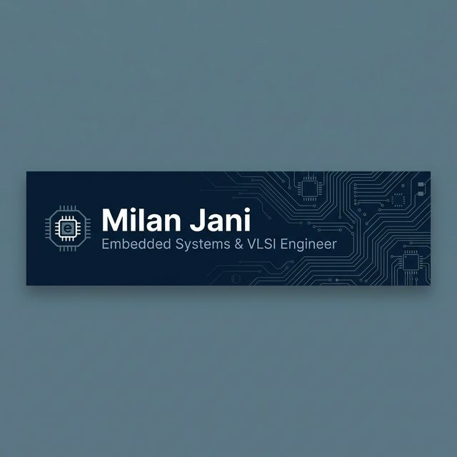

# 👨‍💻 Hi, I'm Milan Jani
**Embedded Systems & VLSI Aspirant | B.Tech (ICT) Student**

### *"Eager to Learn, Driven to Contribute"*

---

### 🚀 About Me
I am a dedicated **B.Tech ICT Student** with a core focus on **Embedded Systems**, **VLSI Design**, and **Hardware-Software Co-Design**. My experience spans from automating backend IC design flows to optimizing MIMO antennas for 5G. 

**Currently seeking Internship & Research Opportunities** to apply my skills in real-world environments and contribute to impactful hardware-focused projects.

### 📊 GitHub Profile Stats

  <table border="0">
    <tr>
      <td>
        
      </td>
      <td>
        
      </td>
    </tr>
    <tr>
      <td colspan="2" align="center">
        
      </td>
    </tr>
  </table>

---

### 🛠️ Technical Skills

| Category | Tools & Technologies |
| :--- | :--- |
| **Languages** | `C`, `C++`, `Python`, `Verilog`, `SQL`, `TCL`, `Shell Scripting`, `Assembly` |
| **Microcontrollers** | `Arduino`, `ESP32`, `STM32`, `Raspberry Pi`, `8051` |
| **Tools & Platforms** | `Linux`, `Git/GitHub`, `NVIDIA Isaac Sim/Lab`, `MATLAB`, `Proteus`, `Wokwi`, `Keil`, `CCS` |
| **Protocols** | `UART`, `SPI`, `I2C`, `CAN` |
| **Core Knowledge** | `Digital Electronics`, `DSA`, `Computer Architecture`, `Computer Networks` |

---

### 👔 Academic & Professional Journey

- **VLSI Intern** | *Microcircuits Innovations Pvt. Ltd.* (June 2025 - July 2025)
  - Focused on automating IC design-flow tasks with Shell and TCL scripts.
- **Research Intern** | *Marwadi University* (July 2024 - Jan 2025)
  - Designed and simulated 5G MIMO antennas using FEM methodology.
- **Education** | *B.Tech in Information & Communication Technology*
  - Marwadi University | Current CPI: **9.03/10.0**

---

### 🏆 Key Projects & Achievements

- 📜 **Patent Published (2024)**: *LPG Cylinder Monitoring and Leak Alert System* (No: 202421033238).
- 🤖 **Robotic Arm Simulation**: Implementing motion planning and control within **NVIDIA Isaac Sim**.
- 🚗 **Smart Vehicle Entry-Exit Logging**: Built a detection and logging system using **OpenCV** and **Python**.
- 🔐 **Embedded Security & Automation**: Developed 10+ prototypes focusing on secure, automated hardware.

---

  <h3>📫 Get in Touch</h3>
  
I'm looking to learn, collaborate, and contribute to cutting-edge <b>Embedded & VLSI</b> projects.

  

 

  Generated with ❤️ for Milan Jani

