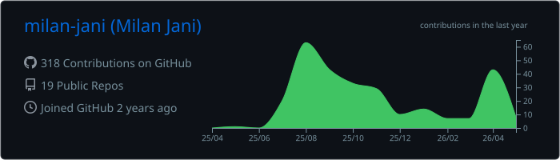
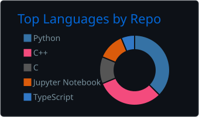
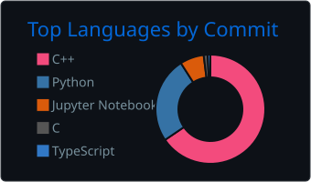
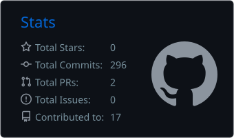
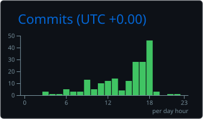

<div align="center">

<!-- ═══════════════════════════════════════════════════════════ -->
<!-- Capsule Render — Animated Waving Header (Indigo/Blue tone) -->
<!-- ═══════════════════════════════════════════════════════════ -->


<!-- Typing SVG Animation -->
<a href="https://git.io/typing-svg">
  
</a>

<br>

<!-- Profile Views Counter -->


</div>

<!-- ─── Section Divider: Indigo ─── -->


##  &nbsp;About Me

```yaml
Name: Milan Jani
Education: B.Tech ICT @ Marwadi University (CPI: 9.03)
Focus: Embedded Systems | VLSI Design | Robotics
Location: India 🇮🇳

Currently:
  - 🔬 VLSI Intern @ Microcircuits Innovations Pvt. Ltd.
  - 🤖 Building robotics simulations in NVIDIA Isaac Sim
  - 🧠 Deploying local LLMs (Gemma/Ollama) on edge devices

Interests:
  - ⚡ Hardware-Software Co-Design
  - 🔌 Serial Protocols (UART, SPI, I2C, CAN)
  - 📡 PCB Design & Circuit Simulation
  - 📝 Writing poetry & shayari in free time
```

<!-- ─── Section Divider: Purple ─── -->


## 🛠️ &nbsp;Tech Arsenal

<div align="center">

<h3>⚙️ Languages & Programming</h3>
<p>
  
</p>

<h3>🔋 Embedded & Hardware</h3>
<p>
  
</p>

<h3>🧰 Tools & Platforms</h3>
<p>
  
</p>

<br>

| Domain | Technologies |
|:---|:---|
| 🔋 **Embedded Platforms** | `Arduino` · `ESP32` · `STM32` · `Raspberry Pi` · `8051` |
| 🛰️ **Protocols** | `UART` · `SPI` · `I2C` · `CAN` |
| 🧠 **Core Domains** | `VLSI Design` · `Digital Electronics` · `Computer Architecture` |
| 🤖 **Simulation** | `NVIDIA Isaac Sim/Lab` · `Proteus` · `MATLAB` |
| 🛠️ **EDA Tools** | `Keil` · `CCS` · `Verilog` · `TCL Scripting` |
| 🧪 **AI/ML** | `Local LLMs (Ollama)` · `Knowledge Distillation` · `OpenCV` |

</div>

<!-- ─── Section Divider: Violet ─── -->


## 📊 &nbsp;GitHub Analytics

<div align="center">

<!-- GitHub Stats (auto-generated by GitHub Action) -->
<a href="https://github.com/milan-jani">
  
</a>

<br>

<a href="https://github.com/milan-jani">
  
</a>
&nbsp;&nbsp;
<a href="https://github.com/milan-jani">
  
</a>

<br>

<a href="https://github.com/milan-jani">
  
</a>
&nbsp;&nbsp;
<a href="https://github.com/milan-jani">
  
</a>

<br><br>

<!-- Streak Stats -->
<a href="https://git.io/streak-stats">
  
</a>

<br><br>

<!-- Contribution Activity Graph -->


<br><br>

<!-- GitHub Trophies -->


</div>

<!-- ─── Section Divider: Light Violet ─── -->


## 🏆 &nbsp;Achievements & Projects

<div align="center">

| | Achievement |
|:---:|:---|
| 📜 | **Patent Holder** — *LPG Cylinder Monitoring and Leak Alert System* (No: 202421033238) |
| 🤖 | **Robotics** — Motion planning & control in **NVIDIA Isaac Sim** |
| 🚗 | **Computer Vision** — Smart Vehicle Entry-Exit Logging via **OpenCV** |
| 🔬 | **Research Intern** — Marwadi University |
| 🎓 | **Academic Excellence** — B.Tech ICT, CPI: **9.03** |

</div>

<!-- ─── Section Divider: Soft Lavender ─── -->


## 🤝 &nbsp;Let's Connect

<div align="center">
<br>

<a href="https://www.linkedin.com/in/milan-jani/">
  
</a>
&nbsp;
<a href="mailto:janimilan7077@gmail.com">
  
</a>
&nbsp;
<a href="https://github.com/milan-jani">
  
</a>

<br><br>

<i>"Engineering the future, one circuit and one line of code at a time."</i>

<br>
</div>

<!-- Contribution Snake Animation -->
<div align="center">
<picture>
  <source media="(prefers-color-scheme: dark)" srcset="https://raw.githubusercontent.com/milan-jani/milan-jani/output/github-snake-dark.svg" />
  <source media="(prefers-color-scheme: light)" srcset="https://raw.githubusercontent.com/milan-jani/milan-jani/output/github-snake.svg" />
  
</picture>
</div>

<!-- Capsule Render — Animated Waving Footer (matching Indigo/Blue) -->

